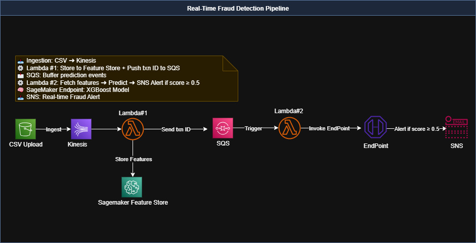

# 🚨 Real-Time Fraud Detection System (XGBoost + AWS Streaming)

An end-to-end production-ready fraud detection pipeline using AWS services for real-time inference, alerting, and orchestration.

---

## 🚀 Overview

This project simulates real-time financial transaction monitoring and detects fraudulent activity using an XGBoost model hosted on SageMaker. The system integrates:

- **Kinesis** for live transaction streaming
- **Lambda Functions** for processing and inference
- **SageMaker Feature Store** for centralized feature storage
- **SageMaker Endpoint** for real-time XGBoost inference
- **SNS + SQS** for alerting and decoupled coordination

---

## 🧠 Architecture



## 📈 Model

- Trained XGBoost classifier on credit card fraud dataset (imbalanced binary classification)
- Packaged + deployed from Colab to SageMaker as a `.tar.gz` artifact
- Inference triggered in real-time by Lambda #2

---
📊 Model Evaluation (Offline, Noisy Test Set)
Evaluated on 50K test samples with randomized noise on 20% of features

Metrics:
Precision: 97.9%
Recall: 95.9%
F1 Score: 96.9%
Avg Inference Latency: <1µs (batch mode, in-memory)
Confirms strong generalization and production readiness for real-time deployment

---
## 🧪 Data Simulation

- `/simulator/push_to_kinesis.py`: Simulates real-time transaction injection
- Transactions are streamed to `fraud-transactions-input` Kinesis stream

---

## 🧩 Lambda Functions

### Lambda #1 – `lambda_ingest_featurestore/`
- Triggered by Kinesis
- Parses incoming transactions
- Adds transaction_id + timestamp
- Stores full record to SageMaker Feature Store
- Sends transaction_id to SQS for downstream inference

### Lambda #2 – `lambda_predict_alert/`
- Triggered by SQS
- Uses transaction_id to query Feature Store
- Sends feature vector to SageMaker XGBoost endpoint
- If score > 0.5 → triggers SNS alert

---

## 📬 SNS Alerts

- High-risk transactions trigger fraud alert emails via SNS
- Can be extended to Slack/Webhook integrations

---

## 📁 Folder Structure

```
real-time-xgb-fraud-detection/
│
├── lambda_ingest_featurestore/
│   └── lambda_function.py
│
├── lambda_predict_alert/
│   └── lambda_function.py
│
├── model/
│   └── train_deploy_notebook.ipynb
│
├── simulator/
│   └── push_to_kinesis.py
│
├── diagram/
│   └── architecture.png
│
├── README.md
```

---

## 📹 Demo (Optional Screencast)

- ✅ Lambda #1 processing logs (CloudWatch)
- ✅ SQS delivery verification
- ✅ Lambda #2 inference + alert
- ✅ SNS fraud alert email

---

## 🛠️ Future Enhancements

- Add Drift Detection
- Integrate CloudWatch metrics dashboard
- Auto-retraining pipeline via EventBridge or Step Functions

---

## 👤 Author

Jayshree Pillai – Machine Learning Engineer  
